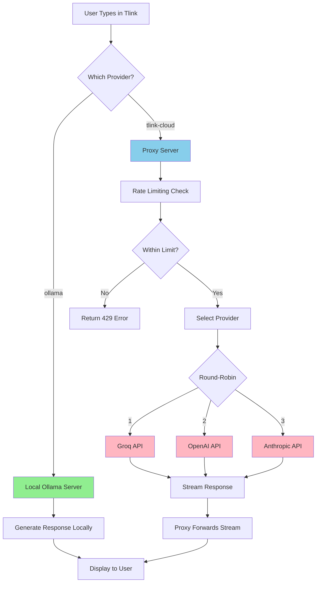

# Tlink AI Proxy Server - Flowcharts

## Architecture Overview

```
┌─────────────────────────────────────────────────────────────────┐
│                         USER'S COMPUTER                          │
│                                                                   │
│  ┌──────────────┐         ┌──────────────┐                      │
│  │   Tlink App  │────────▶│  AI Assistant│                      │
│  │              │         │   Component  │                      │
│  └──────────────┘         └──────┬───────┘                      │
│                                   │                               │
│                                   │ Request                       │
│                                   ▼                               │
│                          ┌─────────────────┐                     │
│                          │ Provider Config │                     │
│                          │  (Ollama/Proxy) │                     │
│                          └────────┬────────┘                     │
│                                   │                               │
└───────────────────────────────────┼───────────────────────────────┘
                                    │
                                    │ HTTP Request
                                    │ POST /v1/chat/completions
                                    │
                                    ▼
┌─────────────────────────────────────────────────────────────────┐
│                    YOUR PROXY SERVER (Cloud)                     │
│                                                                   │
│  ┌──────────────────────────────────────────────────────────┐   │
│  │                    Express Server                        │   │
│  │  ┌────────────┐  ┌────────────┐  ┌────────────┐        │   │
│  │  │   CORS     │  │ Rate Limit │  │  Helmet    │        │   │
│  │  │  Middleware│  │  Middleware│  │  Security  │        │   │
│  │  └────────────┘  └────────────┘  └────────────┘        │   │
│  └──────────────────────────────────────────────────────────┘   │
│                            │                                      │
│                            ▼                                      │
│                  ┌─────────────────┐                            │
│                  │  Route Handler  │                            │
│                  │ /v1/chat/completions                         │
│                  └────────┬────────┘                            │
│                           │                                       │
│                           ▼                                       │
│              ┌────────────────────────┐                          │
│              │  Provider Selector     │                          │
│              │  (Round-robin/Cheapest)│                          │
│              └────────┬───────────────┘                          │
│                       │                                           │
│                       ▼                                           │
│          ┌────────────────────────────┐                          │
│          │  Provider Config Loader    │                          │
│          │  (Get API Key from .env)   │                          │
│          └────────┬───────────────────┘                          │
│                   │                                               │
└───────────────────┼───────────────────────────────────────────────┘
                    │
                    │ Forward Request with API Key
                    │
                    ▼
┌─────────────────────────────────────────────────────────────────┐
│                    AI PROVIDER APIs (Cloud)                      │
│                                                                   │
│  ┌──────────────┐  ┌──────────────┐  ┌──────────────┐          │
│  │    Groq      │  │   OpenAI     │  │  Anthropic   │          │
│  │  api.groq.com│  │api.openai.com│  │api.anthropic.│          │
│  │              │  │              │  │     com     │          │
│  └──────────────┘  └──────────────┘  └──────────────┘          │
│                                                                   │
└─────────────────────────────────────────────────────────────────┘
```

---

## Request Flow (Detailed)

```
┌─────────────┐
│   User      │
│  Types in   │
│  Tlink Chat │
└──────┬──────┘
       │
       ▼
┌─────────────────────────────────────┐
│  Tlink AI Assistant Component       │
│                                     │
│  1. User sends message              │
│  2. Check provider config           │
│     - If "ollama": Use local        │
│     - If "tlink-cloud": Use proxy   │
└──────┬──────────────────────────────┘
       │
       │ Provider = "tlink-cloud"
       │
       ▼
┌─────────────────────────────────────┐
│  HTTP POST Request                  │
│  URL: https://proxy.railway.app/v1/│
│       chat/completions              │
│  Body: {                            │
│    model: "auto",                   │
│    messages: [...],                 │
│    stream: true                     │
│  }                                  │
└──────┬──────────────────────────────┘
       │
       │ Internet
       │
       ▼
┌─────────────────────────────────────┐
│  Proxy Server (Railway/Render)      │
│                                     │
│  ┌──────────────────────────────┐  │
│  │ 1. Receive Request           │  │
│  │    - Extract IP address      │  │
│  │    - Parse JSON body         │  │
│  └──────────┬───────────────────┘  │
│             │                       │
│             ▼                       │
│  ┌──────────────────────────────┐  │
│  │ 2. Rate Limiting Check       │  │
│  │    - Check IP in rate limit  │  │
│  │    - Allow/Deny request      │  │
│  └──────────┬───────────────────┘  │
│             │                       │
│             ▼                       │
│  ┌──────────────────────────────┐  │
│  │ 3. Select Provider            │  │
│  │    Strategy: round-robin      │  │
│  │    - Groq → OpenAI → Groq... │  │
│  └──────────┬───────────────────┘  │
│             │                       │
│             ▼                       │
│  ┌──────────────────────────────┐  │
│  │ 4. Load Provider Config      │  │
│  │    - Get API key from .env   │  │
│  │    - Get base URL            │  │
│  └──────────┬───────────────────┘  │
│             │                       │
│             ▼                       │
│  ┌──────────────────────────────┐  │
│  │ 5. Forward to AI Provider    │  │
│  │    POST api.groq.com/v1/... │  │
│  │    Headers:                  │  │
│  │    Authorization: Bearer... │  │
│  └──────────┬───────────────────┘  │
│             │                       │
└─────────────┼───────────────────────┘
              │
              │ HTTP Request
              │ (with your API key)
              │
              ▼
┌─────────────────────────────────────┐
│  AI Provider (e.g., Groq)          │
│                                     │
│  ┌──────────────────────────────┐  │
│  │ 1. Validate API Key         │  │
│  │ 2. Process Request           │  │
│  │ 3. Generate Response         │  │
│  │ 4. Stream Response           │  │
│  └──────────┬───────────────────┘  │
│             │                       │
└─────────────┼───────────────────────┘
              │
              │ Stream Response
              │ (SSE format)
              │
              ▼
┌─────────────────────────────────────┐
│  Proxy Server                       │
│                                     │
│  ┌──────────────────────────────┐  │
│  │ 6. Receive Stream            │  │
│  │ 7. Forward Stream to User    │  │
│  │    (No modification)        │  │
│  └──────────┬───────────────────┘  │
│             │                       │
└─────────────┼───────────────────────┘
              │
              │ Stream Response
              │
              ▼
┌─────────────────────────────────────┐
│  Tlink AI Assistant                 │
│                                     │
│  ┌──────────────────────────────┐  │
│  │ 8. Receive Stream            │  │
│  │ 9. Parse SSE Events           │  │
│  │ 10. Update UI in real-time   │  │
│  └──────────┬───────────────────┘  │
│             │                       │
└─────────────┼───────────────────────┘
              │
              ▼
┌─────────────┐
│   User      │
│  Sees AI    │
│  Response   │
│  Streaming  │
└─────────────┘
```

---

## Provider Selection Flow

```
┌─────────────────────────────────────┐
│  Request Arrives at Proxy           │
└──────────────┬──────────────────────┘
               │
               ▼
┌─────────────────────────────────────┐
│  Provider Selector                  │
│  Strategy: round-robin              │
└──────────────┬──────────────────────┘
               │
               ▼
      ┌────────────────┐
      │ Get All        │
      │ Enabled        │
      │ Providers      │
      └────────┬───────┘
               │
               ▼
    ┌──────────────────────┐
    │ Available Providers: │
    │ 1. Groq ✅          │
    │ 2. OpenAI ✅        │
    │ 3. Anthropic ❌     │
    │    (no API key)     │
    └──────────┬───────────┘
               │
               ▼
    ┌──────────────────────┐
    │ Filter Enabled Only  │
    │ Result: [Groq, OpenAI]│
    └──────────┬───────────┘
               │
               ▼
    ┌──────────────────────┐
    │ Round-Robin Logic    │
    │                      │
    │ Request 1 → Groq     │
    │ Request 2 → OpenAI   │
    │ Request 3 → Groq     │
    │ Request 4 → OpenAI   │
    │ ...                  │
    └──────────┬───────────┘
               │
               ▼
    ┌──────────────────────┐
    │ Selected Provider    │
    │ Example: Groq        │
    └──────────┬───────────┘
               │
               ▼
    ┌──────────────────────┐
    │ Load Config          │
    │ - API Key            │
    │ - Base URL           │
    │ - Timeout            │
    └──────────┬───────────┘
               │
               ▼
    ┌──────────────────────┐
    │ Forward Request      │
    │ to Selected Provider │
    └──────────────────────┘
```

---

## Local vs Proxy Flow Comparison

### Option 1: Local Ollama (Free, Default)

```
┌─────────────┐
│   User      │
│  Types in   │
│  Tlink      │
└──────┬──────┘
       │
       ▼
┌─────────────────────────────────────┐
│  Tlink AI Assistant                 │
│  Provider: "ollama"                 │
└──────┬──────────────────────────────┘
       │
       │ Local HTTP Request
       │ (no internet needed)
       │
       ▼
┌─────────────────────────────────────┐
│  Local Ollama Server                │
│  Running on: localhost:11434         │
│                                     │
│  ┌──────────────────────────────┐  │
│  │ 1. Receive Request           │  │
│  │ 2. Load Model (llama3.1:8b)  │  │
│  │ 3. Generate Response         │  │
│  │ 4. Stream Response          │  │
│  └──────────┬───────────────────┘  │
│             │                       │
└─────────────┼───────────────────────┘
              │
              │ Stream Response
              │
              ▼
┌─────────────────────────────────────┐
│  Tlink AI Assistant                 │
│  Display Response                   │
└─────────────────────────────────────┘

✅ No API costs
✅ Works offline
✅ Privacy (data stays local)
❌ Slower than cloud
❌ Requires 4-8GB disk space
```

### Option 2: Proxy Server (Premium)

```
┌─────────────┐
│   User      │
│  Types in   │
│  Tlink      │
└──────┬──────┘
       │
       ▼
┌─────────────────────────────────────┐
│  Tlink AI Assistant                 │
│  Provider: "tlink-cloud"            │
└──────┬──────────────────────────────┘
       │
       │ Internet Request
       │ (HTTPS)
       │
       ▼
┌─────────────────────────────────────┐
│  Your Proxy Server                  │
│  (Railway/Render/AWS)               │
│                                     │
│  ┌──────────────────────────────┐  │
│  │ Rate Limiting                │  │
│  │ Provider Selection           │  │
│  │ API Key Management           │  │
│  └──────────┬───────────────────┘  │
│             │                       │
└─────────────┼───────────────────────┘
              │
              │ Forward with API Key
              │
              ▼
┌─────────────────────────────────────┐
│  AI Provider (Groq/OpenAI/etc)      │
│                                     │
│  ┌──────────────────────────────┐  │
│  │ Process & Generate           │  │
│  │ Stream Response              │  │
│  └──────────┬───────────────────┘  │
│             │                       │
└─────────────┼───────────────────────┘
              │
              │ Stream Response
              │
              ▼
┌─────────────────────────────────────┐
│  Proxy Server                       │
│  Forward to User                    │
└──────┬──────────────────────────────┘
       │
       │ Stream Response
       │
       ▼
┌─────────────────────────────────────┐
│  Tlink AI Assistant                 │
│  Display Response                   │
└─────────────────────────────────────┘

✅ Faster than local
✅ No user API keys needed
✅ Multiple models available
❌ Requires internet
❌ You pay API costs
❌ Data goes through your server
```

---

## Deployment Flow

```
┌─────────────────────────────────────┐
│  Development (Local)                │
│                                     │
│  1. Write code                      │
│  2. Test locally                    │
│     npm start                       │
│  3. Test with Tlink                 │
│     baseURL: http://localhost:3000  │
└──────────────┬──────────────────────┘
               │
               │ Ready to deploy?
               │
               ▼
    ┌──────────────────────┐
    │ Choose Platform       │
    └──────────┬───────────┘
               │
    ┌──────────┴───────────┐
    │                      │
    ▼                      ▼
┌──────────┐        ┌──────────┐
│ Railway  │        │ Render   │
│ (Easiest)│        │ (Similar)│
└────┬─────┘        └────┬─────┘
     │                  │
     │                  │
     └──────────┬───────┘
                │
                ▼
    ┌──────────────────────┐
    │ 1. Push to GitHub     │
    │ 2. Connect Platform  │
    │ 3. Add Env Variables  │
    │ 4. Deploy             │
    └──────────┬───────────┘
               │
               ▼
    ┌──────────────────────┐
    │ Get Deployment URL    │
    │ https://xxx.railway.  │
    │        app           │
    └──────────┬───────────┘
               │
               ▼
    ┌──────────────────────┐
    │ Update Tlink Config  │
    │ baseURL: new URL     │
    └──────────┬───────────┘
               │
               ▼
    ┌──────────────────────┐
    │ Production Ready!     │
    │ Users can use proxy   │
    └──────────────────────┘
```

---

## Error Handling Flow

```
┌─────────────────────────────────────┐
│  Request from Tlink                 │
└──────────────┬──────────────────────┘
               │
               ▼
    ┌──────────────────────┐
    │ Rate Limit Check     │
    └──────────┬───────────┘
               │
        ┌──────┴──────┐
        │             │
        ▼             ▼
    ┌──────┐    ┌──────────┐
    │ Pass │    │ Too Many │
    │      │    │ Requests │
    └──┬───┘    └────┬─────┘
       │             │
       │             ▼
       │    ┌────────────────┐
       │    │ Return 429     │
       │    │ Error          │
       │    └────────────────┘
       │
       ▼
┌──────────────────────┐
│ Select Provider      │
└──────────┬───────────┘
           │
    ┌──────┴──────┐
    │             │
    ▼             ▼
┌──────┐    ┌──────────┐
│Found │    │ Not Found│
│      │    │          │
└──┬───┘    └────┬─────┘
   │             │
   │             ▼
   │    ┌────────────────┐
   │    │ Return 503     │
   │    │ No Providers   │
   │    └────────────────┘
   │
   ▼
┌──────────────────────┐
│ Forward to Provider  │
└──────────┬───────────┘
           │
    ┌──────┴──────┐
    │             │
    ▼             ▼
┌──────┐    ┌──────────┐
│Success│    │  Error   │
│       │    │          │
└──┬───┘    └────┬─────┘
   │             │
   │    ┌────────┴────────┐
   │    │                 │
   │    ▼                 ▼
   │┌────────┐    ┌──────────────┐
   ││Stream  │    │ Provider     │
   ││Response│    │ Error (4xx)  │
   │└───┬────┘    └──────┬───────┘
   │    │                 │
   │    │                 ▼
   │    │    ┌────────────────────┐
   │    │    │ Forward Error      │
   │    │    │ to User            │
   │    │    └────────────────────┘
   │    │
   │    ▼
   │┌────────────────────┐
   ││ Forward Stream      │
   ││ to Tlink            │
   │└─────────────────────┘
```

---

## Data Flow Diagram

```
┌─────────────────────────────────────────────────────────────┐
│                    USER REQUEST                             │
│  {                                                           │
│    "model": "auto",                                          │
│    "messages": [                                             │
│      {"role": "user", "content": "Hello"}                   │
│    ],                                                        │
│    "stream": true                                            │
│  }                                                           │
└──────────────────────┬──────────────────────────────────────┘
                       │
                       ▼
┌─────────────────────────────────────────────────────────────┐
│              PROXY SERVER PROCESSING                         │
│                                                               │
│  1. Add API Key (from .env)                                  │
│     Authorization: Bearer gsk_xxx                            │
│                                                               │
│  2. Select Provider (e.g., Groq)                             │
│                                                               │
│  3. Transform Request (if needed)                            │
│     {                                                         │
│       "model": "llama-3.1-8b-instant",  ← Auto-selected     │
│       "messages": [...],                                     │
│       "stream": true                                         │
│     }                                                         │
└──────────────────────┬──────────────────────────────────────┘
                       │
                       ▼
┌─────────────────────────────────────────────────────────────┐
│              AI PROVIDER RESPONSE (Stream)                   │
│                                                               │
│  data: {"id":"chatcmpl-123","choices":[{"delta":{"content":  │
│  "Hello"}}]}                                                 │
│                                                               │
│  data: {"id":"chatcmpl-123","choices":[{"delta":{"content":  │
│  "!"}}]}                                                     │
│                                                               │
│  data: [DONE]                                                │
└──────────────────────┬──────────────────────────────────────┘
                       │
                       │ (No modification, just forward)
                       │
                       ▼
┌─────────────────────────────────────────────────────────────┐
│              TLINK RECEIVES STREAM                          │
│                                                               │
│  Parse SSE events → Update UI in real-time                   │
└─────────────────────────────────────────────────────────────┘
```

---

## Summary: Complete System Flow

```
                    ┌─────────────┐
                    │   User      │
                    └──────┬──────┘
                           │
                           │ Types message
                           │
                    ┌──────▼──────────────────┐
                    │  Tlink App               │
                    │  ┌────────────────────┐ │
                    │  │ AI Assistant UI    │ │
                    │  └────────┬───────────┘ │
                    │           │             │
                    │  ┌────────▼───────────┐ │
                    │  │ Provider Config   │ │
                    │  │ - ollama (local)  │ │
                    │  │ - tlink-cloud     │ │
                    │  └────────┬───────────┘ │
                    └───────────┼─────────────┘
                                │
                    ┌───────────┴───────────┐
                    │                       │
                    ▼                       ▼
        ┌──────────────────┐    ┌──────────────────────┐
        │  Local Ollama    │    │  Proxy Server        │
        │  (localhost)     │    │  (Cloud)             │
        │                  │    │                      │
        │  ✅ Free         │    │  ┌────────────────┐ │
        │  ✅ Private      │    │  │ Rate Limiting   │ │
        │  ✅ Offline      │    │  │ Provider Select│ │
        │  ❌ Slower       │    │  │ API Key Mgmt   │ │
        └────────┬─────────┘    │  └────────┬───────┘ │
                 │              │           │          │
                 │              │           ▼          │
                 │              │  ┌─────────────────┐ │
                 │              │  │ AI Providers    │ │
                 │              │  │ (Groq/OpenAI)   │ │
                 │              │  └─────────────────┘ │
                 │              └──────────────────────┘
                 │
                 │
        ┌────────▼─────────┐
        │  Response        │
        │  Stream          │
        └────────┬─────────┘
                 │
                 ▼
        ┌──────────────────┐
        │  Display to User │
        └──────────────────┘
```

---

## Key Decision Points

```
                    Start: User sends message
                           │
                           ▼
                    ┌──────────────┐
                    │ Check Config │
                    │ Which        │
                    │ Provider?    │
                    └──────┬───────┘
                           │
            ┌──────────────┴──────────────┐
            │                             │
            ▼                             ▼
    ┌───────────────┐          ┌──────────────────┐
    │ Provider =    │          │ Provider =       │
    │ "ollama"      │          │ "tlink-cloud"    │
    └───────┬───────┘          └────────┬─────────┘
            │                            │
            │                            │
            ▼                            ▼
    ┌───────────────┐          ┌──────────────────┐
    │ Use Local     │          │ Use Proxy        │
    │ Ollama        │          │ Server            │
    │               │          │                   │
    │ ✅ No cost    │          │ ✅ Faster         │
    │ ✅ Private    │          │ ✅ No user keys   │
    │ ✅ Offline    │          │ ❌ You pay        │
    └───────────────┘          └──────────────────┘
```

---

## Mermaid Diagram (Alternative Format)

If you prefer Mermaid syntax for rendering in Markdown viewers:



---

## Quick Reference

| Component | Location | Purpose |
|-----------|----------|---------|
| **Tlink App** | User's computer | UI and user interaction |
| **Proxy Server** | Cloud (Railway/Render) | Route requests, manage API keys |
| **AI Providers** | Cloud (Groq/OpenAI/etc) | Generate AI responses |
| **Local Ollama** | User's computer | Free alternative, works offline |

---

## Next Steps

1. **Review flowcharts** to understand architecture
2. **Follow QUICKSTART.md** to set up proxy server
3. **See INTEGRATION.md** to connect Tlink
4. **Check DEPLOYMENT.md** for hosting options
