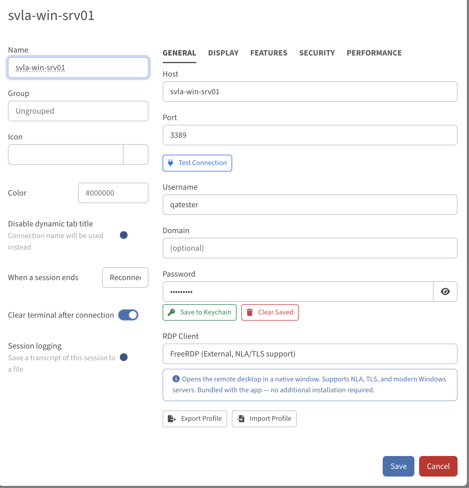
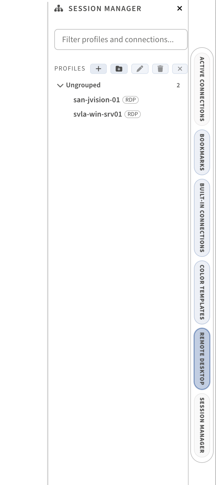

# NexTerm RDP Plugin

Remote Desktop Protocol (RDP) connections for NexTerm.

## Screenshots

| Profile Configuration | Save & Connect |
|:---:|:---:|
|  |  |

## Client Types

### FreeRDP (Recommended)
Opens the remote desktop in a native window using FreeRDP's SDL3 client.

- **NLA, TLS, and RDP security** supported
- **Bundled with the app** on macOS (no installation required)
- Native rendering via SDL3 (no XQuartz needed)
- RemoteFX graphics pipeline for fast performance
- Dynamic resolution (resize window to adjust)

### node-rdpjs (Embedded)
Renders the remote desktop directly inside the NexTerm tab using HTML5 Canvas.

- **SSL security only** - may not work with servers that require NLA
- No external dependencies
- Best for servers that don't require Network Level Authentication

### System RDP Client
Generates a `.rdp` file and opens it with the system's default RDP application.

- Uses Microsoft Remote Desktop (Windows App) on macOS
- Uses mstsc.exe on Windows
- Uses Remmina or similar on Linux
- Password must be entered in the external app

## Profile Settings

### General
| Setting | Description |
|---------|-------------|
| Host | RDP server hostname or IP |
| Port | RDP port (default: 3389) |
| Username | Login username |
| Domain | Windows domain (optional) |
| Password | Saved in profile or system keychain |
| RDP Client | Choose between FreeRDP, node-rdpjs, or System RDP Client |

### Display
| Setting | Description |
|---------|-------------|
| Width | Desktop width in pixels (default: 1920) |
| Height | Desktop height in pixels (default: 1080) |
| Color Depth | 8, 16, 24, or 32-bit color |

### Features
| Setting | Description |
|---------|-------------|
| Audio Redirection | Play remote audio locally |
| Clipboard Sharing | Share clipboard between local and remote |
| Printer Redirection | Access local printers from remote |
| Drive Mapping | Map local drives to remote session |
| Wallpaper | Show desktop wallpaper (disable for speed) |
| Themes | Show Windows themes (disable for speed) |
| Font Smoothing | Enable ClearType font rendering |
| Desktop Composition | Enable Aero glass effects |

### Security
| Setting | Description |
|---------|-------------|
| Enable NLA | Network Level Authentication (recommended) |
| Enable TLS | TLS encryption |
| Ignore Certificate Errors | Skip certificate validation (less secure) |

### Performance
| Setting | Description |
|---------|-------------|
| Compression | Enable data compression |
| Bitmap Caching | Cache bitmap data for faster rendering |

### Advanced
| Setting | Description |
|---------|-------------|
| Custom FreeRDP Parameters | Additional command-line arguments for FreeRDP |

## FreeRDP Performance Flags

The FreeRDP client automatically applies these optimizations:

- `/gfx:RFX` - RemoteFX graphics pipeline
- `/gdi:hw` - Hardware-accelerated GDI rendering
- `/network:auto` - Auto-detect network conditions
- `+multitransport` - UDP transport for lower latency
- `/dynamic-resolution` - Auto-resize on window resize

## Bundled Binary

On macOS, `sdl-freerdp` is bundled in `extras/freerdp/mac/` with all required dynamic libraries (~45MB). This provides:

- Native macOS window rendering (no X11/XQuartz)
- Full NLA/TLS/CredSSP authentication support
- H.264 and RemoteFX codec support via ffmpeg

## Session Logging

Enable session logging in the Performance tab to record connection events to JSONL files. Optional keyboard/mouse event logging is available for auditing.

## Keychain Integration

Passwords can be saved to the system keychain (macOS Keychain, Windows Credential Manager, or Linux Secret Service) via the "Save to Keychain" button in profile settings.

## Architecture

```
tlink-rdp/
  src/
    api/interfaces.ts       - RDPProfile and options types
    components/
      rdpTab.component.*    - Connection UI, canvas rendering, error handling
      rdpProfileSettings.*  - Profile configuration UI
    services/
      rdp.service.ts        - FreeRDP launcher, .rdp file generator, XQuartz detection
      passwordStorage.ts    - Keychain integration
      sessionLogger.ts      - Session event logging
    session/rdp.ts          - node-rdpjs wrapper
    config.ts               - Default settings
    profiles.ts             - Profile provider, quick-connect
    hotkeys.ts              - Session restart hotkey
    recoveryProvider.ts     - Tab recovery after crash
```
